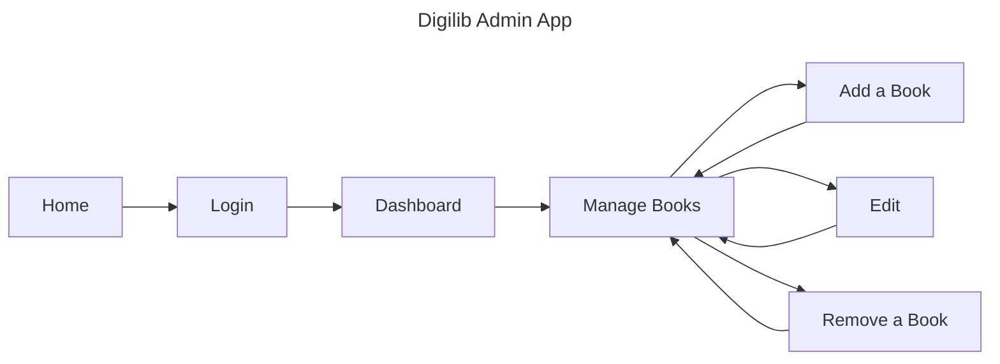
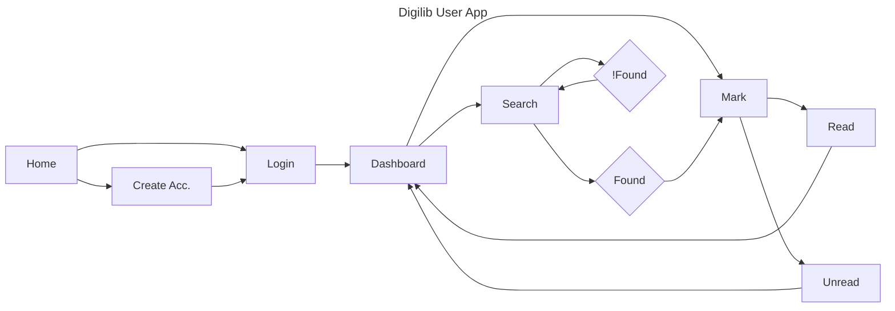

## DigiLib Overview

A local city library has hired us to design an app for their avid readers. The app should catalog all the their books and allow patrons to mark books as read or "want-to-read" (inspiration: [Caliber](https://calibre-ebook.com/) and [caliber-web](https://books.deletosh.com/), [source code](https://github.com/janeczku/calibre-web))

## Getting Started

- cd <your project directory>
- `git clone git@github.com:msimbo/digilib.git`
- `cd digilib`
- type `yarn` (to install all this project's dependencies)
- Create you feature branch e.g. "feature/\*-github id" ([read this guide](https://dev.to/varbsan/a-simplified-convention-for-naming-branches-and-commits-in-git-il4) on why we name branches this way)
- Work, commit your work, push and submit a [PR](https://docs.github.com/en/pull-requests/collaborating-with-pull-requests/proposing-changes-to-your-work-with-pull-requests/creating-a-pull-request)

## Installation
- Install "Markdown Preview Mermaid Support" extension
- Launch from catalogue "Markdown: Open Preview to the Side" or "Markdown: Open Preview" to preview

## User Flow
[x] @TODO use mermaid to create user journey chart for user admin as a system.

### Admin User flow

### Patron User Flow
[x] @TODO use mermaid to create user journey chart for app user as a system.

## App Architecture

@TODO Ref issue #6

// k4Vh60SJzOVUgMit